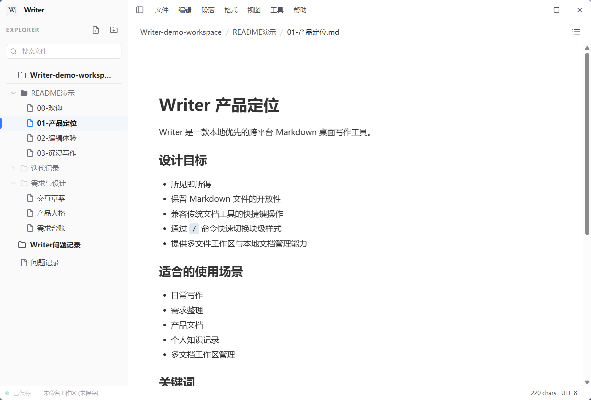
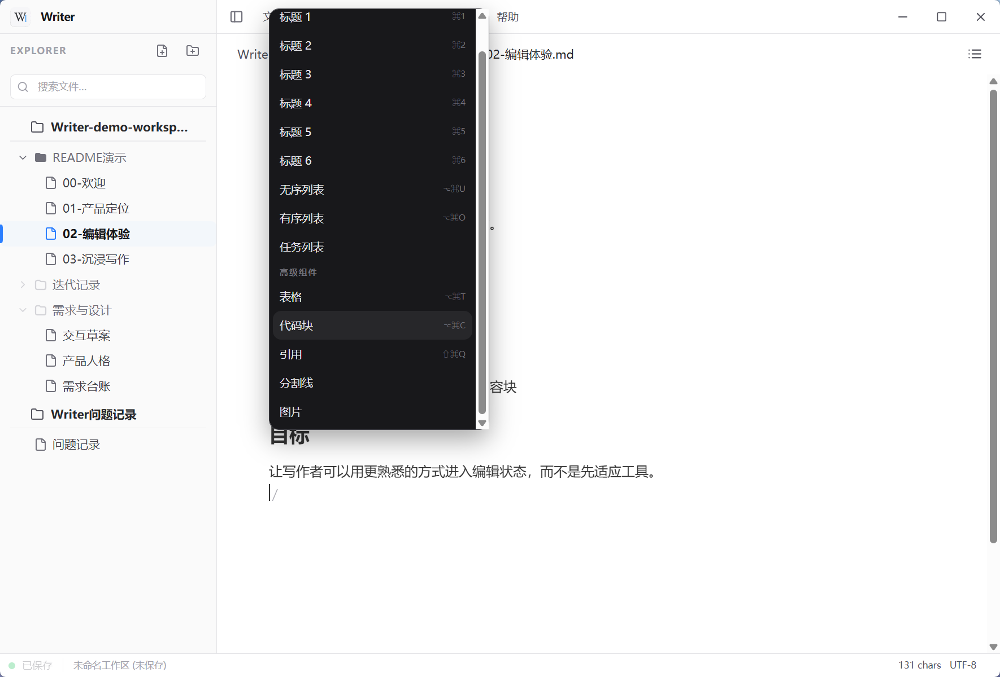

# Writer

English | [简体中文](./README.md)


Writer is a local-first cross-platform Markdown desktop writing tool.  
It aims to bring together **WYSIWYG-style editing, Markdown compatibility, and multi-file workspace management** in a lightweight desktop application, so users with different editing habits can enter a natural writing flow more easily.

> Current Status: In an active early development stage (v0.3.x). Core editing and file management capabilities are already in place.

---

## ✨ Why Writer

If you want to:

- keep the openness and portability of Markdown files
- avoid being interrupted by raw markup while writing
- use familiar shortcuts like in traditional document tools
- manage multiple local files and folders within one workspace

then Writer is trying to solve exactly this combination of needs.

---

## ✨ Core Features

### WYSIWYG editing with Markdown compatibility
Built on TipTap, Writer supports real-time parsing and rendering of Markdown syntax.  
It reduces visual friction from markup while still keeping Markdown files as the underlying storage format.

### Compatible with different editing habits
Writer is not designed around only one style of editing. It tries to support multiple common writing workflows:

- traditional document-style keyboard shortcuts
- quick style changes after selecting text
- direct editing similar to Typora
- slash-command driven block insertion and formatting via `/`

### Local workspace management
Writer provides local-file-based workspace organization, including:

- multi-folder workspaces
- file tree navigation
- multi-level directory structures
- a workspace model suitable for long-form writing and structured content

### Immersive writing experience
Writer includes focused writing modes for cleaner long-form editing.  
In Zen mode, interface distractions can be reduced further to help writers stay centered on the document itself.

### Lightweight, fast, and cross-platform
Powered by Rust and Tauri, Writer keeps a relatively small package size and responsive startup behavior on desktop platforms.  
The long-term goal is to provide a consistent writing experience across platforms.

---

## 🖼️ Interface Preview

### Multi-file workspace and local document management


Organize local documents through a file-tree-based workspace, with a clear split between navigation and focused editing.

### Type `/` to open the command menu


Use Slash Command to quickly insert headings, lists, tables, code blocks, and other content blocks without leaving the editor flow.

---

## 🖥️ Platform Support

Current support status:

- Windows (Windows 10 / 11): routine development and testing
- macOS (Intel / Apple Silicon): major environments tested
- Linux: under ongoing compatibility work and further refinement

---

## 📦 Download & Usage

Download installers for your platform from the [Releases](https://github.com/xczl-785/Writer/releases) page.

- Windows: `.msi` / `.exe`
- macOS: `.dmg`
- Linux: `.AppImage` / `.deb`

---

## 🛠️ Developer Guide

Before contributing, make sure the following toolchains are installed:

- [Node.js](https://nodejs.org/) (v20 or higher recommended)
- [pnpm](https://pnpm.io/)
- [Rust](https://www.rust-lang.org/)

### Environment Setup

```bash
git clone https://github.com/xczl-785/Writer.git
cd Writer
pnpm install
```

### Debugging & Build

```
# Start frontend dev server (Web view only)
pnpm dev

# Start Tauri desktop development environment
pnpm tauri dev

# Build production binaries
pnpm build && pnpm tauri build
```

------

## 🏗️ Technical Architecture

- Frontend: React 19, TypeScript, TipTap, Zustand, TailwindCSS
- System layer: Rust, Tauri v2

------

## 🤝 Contributing

Issues and Pull Requests are welcome.
 For proposals involving major architectural changes or core feature direction, opening an Issue first is recommended to reduce design drift.

------

## 📄 License

This project is released under the GPL-3.0 License.
 Free use, modification, and redistribution are allowed, but derivative works and redistributed versions must remain under the same open-source license.
